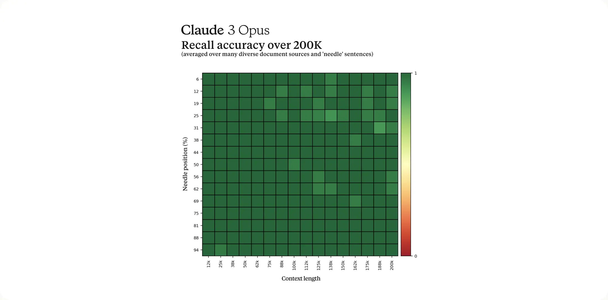

# 本地部署大语言模型的中文教学
Hello!

大家好，这里是Anser!这个是一个尽可能详细地关于大语言模型LLM的本地部署的教学。希望能帮到各位！

如果你希望能够本地运行LLM，不想花钱买API，想要在本地聊天和制作自己的工具，那么这篇文章就是适合你的！

我已经制作了自己用的两个应用。一个是一个多语言翻译器，另一个是一个总结长篇PDF或者网课视频的小工具。所以在这里分享一下我的经验！

我很有可能会犯点错，不过请谅解！还可以告诉我哪里错了怎么改，谢谢！

## 目录

- [本地部署大语言模型的中文教学](#本地部署大语言模型的中文教学)
  - [目录](#目录)
  - [电脑硬件、操作系统、GPU加速的基础知识](#电脑硬件操作系统gpu加速的基础知识)
    - [CPU和RAM](#cpu和ram)
    - [GPU与VRAM](#gpu与vram)
      - [GPU性能](#gpu性能)
      - [VRAM(显存)](#vram显存)
      - [多显卡运算](#多显卡运算)
      - [显存带宽](#显存带宽)
      - [GPU优化](#gpu优化)
    - [内存与显存占用](#内存与显存占用)
    - [FP16与Quantization](#fp16与quantization)
      - [半精度(FP16):](#半精度fp16)
      - [量化(Quantization):](#量化quantization)
    - [Finetune](#finetune)
    - [上下文Context](#上下文context)
      - [Recall accuracy](#recall-accuracy)
  - [如何为LLM配置一台电脑](#如何为llm配置一台电脑)
  - [选择你要用的模型](#选择你要用的模型)
    - [Hugging face demos](#hugging-face-demos)
    - [技术报告](#技术报告)
    - [Benchmark和ranking](#benchmark和ranking)
      - [MMLU](#mmlu)
      - [LMSYS Chatbot Arena](#lmsys-chatbot-arena)
    - [常用模型推荐](#常用模型推荐)
  - [对话与提示](#对话与提示)
    - [系统提示](#系统提示)
    - [系统提示的制作方法](#系统提示的制作方法)
    - [对话格式](#对话格式)
  - [部署方法](#部署方法)
    - [llama.cpp系列](#llamacpp系列)
      - [lmstudio](#lmstudio)
      - [Ollama](#ollama)
      - [llamacpp-python](#llamacpp-python)
    - [ONNX, Intel OpenVino, AMD Vitas AI](#onnx-intel-openvino-amd-vitas-ai)
    - [Python 相关](#python-相关)
      - [Conda与Docker](#conda与docker)
      - [Hugging Face Transformers](#hugging-face-transformers)
      - [Pytorch与Tensorflow](#pytorch与tensorflow)

## 电脑硬件、操作系统、GPU加速的基础知识
电脑硬件相关的知识真的很重要！

很多时候我会被问：我的电脑能跑这个吗？请不要轻易的觉得能跑或者不能跑，LLM飞速发展了两年已经有了很多的可用的部署方法，请往下接着读，看看哪一种方法和模型适合你的电脑

一台电脑，包括笔记本和台式机，常见的组件包括CPU,RAM(内存),硬盘（存储）。GPU和主板电源等。这里和我们任务相关的就只有CPU,RAM,GPU和GPU自带的VRAM。

### CPU和RAM
CPU是电脑的中央处理器。现代CPU真的很快，所以我们可以使用CPU进行大语言模型的推理。

现代CPU在推理一些7B模型也能很快。例如我的小笔记本电脑有着AMD Ryzen R5 7640U（一个28W的笔记本处理器，其实很弱）但是在推理llama3 7B的时候却可以到8Tokens每秒。（Token是什么下面会讲）

RAM也叫内存，不同于硬盘是临时储存数据的地方。

对于使用CPU进行推理，以下是一些关键硬件知识：

1. **CPU性能，CPU核心数与CPU频率**：
    对于使用CPU的大语言模型，我们希望CPU的多核性能尽可能地强。

    CPU核心数决定了同时执行的线程数量。更多的核心数可以提高并行处理能力，从而加快推理速度。你可以在Windows的任务管理器里看到自己的核心数量。

    CPU频率表示每秒钟执行的指令数。较高的频率意味着更快的计算速度。

    此外，你还可以使用其他的跑分软件生成的分数来衡量CPU的性能。相关的分数可以在互联网上搜索，比较常见的有GeekBench，Cinebench等。

    关于CPU的选择：大体来说无所谓，上网找benchmark，看看多核性能谁强然后找个买得起的买就好了。小处确实有差别，但是我觉得不重要，无所谓。
    
    3. **RAM容量**：
    RAM是计算机用于存储数据和程序的临时存储器。当使用CPU进行运算时，运算的部分必须存在RAM中。所以RAM大小很大程度决定了LLM能不能跑。我强烈建议你有至少16GB的内存。

    较大的RAM容量可以提供更多的内存空间，从而减少数据交换和读取的次数，提高推理效率。

    RAM的大小最好要大于模型的大小+操作系统占用的大小。因为CPU只能直接运算存储在RAM中的数据，所以内存如果小于模型的话你就装不下了。

    常见的模型大小就下面这几个挡位，推荐的模型大小对应的内存大小（不过你要小于推荐值下面也有办法，就是使用Quantization压缩模型到更低的精度，不过这样会降低性能就是了，这个后面也会讲）：
    - 6~8B模型：16GB
    - 12~15B模型：16GB
    - 30~35B模型：32GB
    - 60~75B模型：48GB
    - 100~130B模型：64GB

4. **内存带宽**：
    内存带宽决定了数据在RAM和CPU之间传输的速度。较高的内存带宽可以加快数据的读取和写入速度，提高推理性能。
    
    内存带宽对LLM来说速度影响挺大，所以苹果电脑在推理上会很快，因为它的共享内存带宽很高。GPU更快的一个原因也是使用了比普通内存更快的GDDR6内存。

    我的内存使用的是双通道DDR5 5600。你如果会玩超频的话可以超一超内存的频率。支持双通道内存的CPU最好上两根内存条，这样会更快。

    一部分高级笔记本或者工作站会使用频率更高的内存，例如DDR5 7500这种的，理论上这个会对CPU推理有提升，但是我也没有，不知道，另外如果你都用上这种高级货了，我建议还是用GPU推理。

当选择使用CPU进行大语言模型推理时，建议考虑以上硬件因素，并选择具有较高核心数、频率的CPU和足够的内存RAM容量，以获得更好的性能和推理速度。

### GPU与VRAM
GPU(图形处理器)最初是为图形渲染和游戏设计的,但由于其并行计算能力强大,现在也被广泛用于加速AI模型的推理和训练。

#### GPU性能

高端GPU具有数以千计的核心,每个核心可同时执行多个线程,能够高效地并行处理大量的矩阵和向量运算,正是AI模型所需。常见的GPU型号有Nvidia GeForce RTX和AMD Radeon RX系列。目前intel也加入了制作GPU的行业。

此外苹果M系列处理器的集成显卡也很强，能够很好的完成同样的任务。

对于Nvidia卡，越新的代速度越快，架构升级的提升还是挺明显的。尤其是RTX 40系，速度提升蛮大的。在40系的RTX卡中会有对半精度FP16的优化，所以速度提升会比较大。打游戏主要FP32精度是很重要，所以30及之前的GPU没有对半精度特别优化。

#### VRAM(显存)
VRAM是GPU自带的内存,用于存储GPU需要处理的数据和程序指令。与CPU访问主板内存相比,GPU访问VRAM的速度更快。和CPU一样，GPU需要把数据挪到VRAM内才能进行运算。请记住在内存和显存间移动数据也需要花时间。

大型语言模型通常需要大量VRAM，Vram的占用量和上面的RAM的量类似。

一块RTX 3090/RTX 4090/Radeon 7900XTX显卡的显存大小是24GB，你可以用它很快的跑一个Q4精度下32B的模型，估计（我哪来这些卡）在15/20/15Token每秒左右。

一块4060Ti 16GB版有16GB的显存，你可以拿他跑Q4 14B或Q2 32B的模型。Q2精度更低，效果更差但是模型会变小。

大显存是很重要的！

**！！！但是！！！** 你可能会说你的显存太小了装不下，不过这也能跑:

我们可以把LLM分成多个部分拆开分开运算。是的这让它变慢，但是！你可以做的一件事是把LLM的一部分塞进VRAM由GPU运算然后把剩下的部分存在RAM里。

所以我也可以拿24GB的4090跑Q3 70B参数的模型（34GB大小左右），尽管24GB还是装不下，但是我内存RAM装得下就行，然后只需要把正在运算的部分挪入VRAM就可以。不过来回挪也要花时间，所以建议你的显存之和不要小于模型的一半，越大越快，越小越慢。

#### 多显卡运算
同样的，正如你可以把模型切到内存和显存里，你也可以使用多张显卡，然后把模型切到很多个显卡里。这样你可以用4*4060ti 16GB来组合成64GB显存，然后你就可以只用1600美元左右的显卡来跑一个110B的大大模型。

不过切分模型确实会降低速度是了，不过单个最便宜的48GBNvida卡我找到的是一个Quadro RTX 8000也要2400美元左右还是二手的。

对于多GPU配置你可以考虑组合多张卡，例如我在已经有4090的情况下未来可能会考虑加两张16GB的RTX5060（如果未来有的话）来组成一个便宜的56GB内存。这样我可以运行Q3的110B模型或者Q5的72B模型。

此外还有一些阴间操作，我不推荐，但是你觉得你行那也可以试试。

Nvidia有很多老服务器卡会有很大的内存但是很便宜。你可以去搜索Nvidia P40或者K80（这辆都是24GB显存的老卡）。然后你就能看见一堆150美元一张的没风扇的二手服务器卡，你需要使用电源转接头和3D打印来改装一个风扇上去，还有调主板设置之类的。

我说着都嫌麻烦。不过你愿意折腾可以试试。主要是这个价格真的很便宜，而且我保证再老的显卡也比CPU快。

另外当GPU多于三个的时候你需要考虑更多更复杂的东西，例如你的电源PSU，你的PCIE Lane数量，你的机箱大小。你可以考虑使用AMD ThreadRipper或者Intel Xeon CPU（很贵）与其配套的主板来解决之类的问题。像我如果要使用三卡配置的话，那么我的计划是买一个有三个PCIE接口的主板然后直接把三张卡用延展线塞到我的ATX机箱里。

#### 显存带宽
指VRAM与GPU之间数据传输的速率,也决定了GPU的整体性能。较新的GPU使用更快的显存(如GDDR6X)以提高带宽。

#### GPU优化
制造商通过优化的软件库(如Nvidia的TensorRT)和硬件设计(如Tensor Core),进一步提升GPU在AI推理的性能。

Nvidia的GPU优化是做的最好的。当你使用的是最新的的RTX 30/40系时（这也包含其他Ada Lovelace / Ampere架构的卡，例如RTX A5000）你可以使用一部分新的功能进一步提升你的速度，所以我的建议是买新不买旧。

### 内存与显存占用

我在上面有给过一个内存模型大小的对照表，但是实际情况复杂不少，这里展开讲讲。

以1B参数的模型为例子。一个字节是1 Byte，1GB = 10 ^ 9 Byte。
- 参数精度:一般来说,参数使用32位浮点数(FP32)存储。每个FP32参数占用4个字节。
- 参数个数:1B参数=1,000,000,000个参数。
- 附加内存开销:除了存储参数本身,运行模型还需要额外的内存用于中间计算、缓存等。在推理中没有Optimizer这个东西所以这个不用太担心，比较小。
- 如果你跑的是长context（下面会讲），模型也会变大。更短的context length会少量的减少内存占用。

假设使用FP32精度,1B参数模型在32位系统上的总内存占用计算如下:
参数本身: 1,000,000,000 * 4 Byte = 4,000,000,000 Byte = 4 GB
附加内存: 差不多0.3GB
总内存占用: 4 GB

但是如果这样的话4090连7B都跑不了啦~ 

(-_-)!

所以有了各种各样的降低精度来减小内存的方法。

### FP16与Quantization

#### 半精度(FP16):

- FP16，和FP32类似，是一种浮点数据类型,使用16位来存储数值,而常规精度(FP32)使用32位。
- 使用FP16可以将模型的内存需求减少一半,从而允许在相同的GPU内存下加载更大的模型。
- 一些GPU有专门的Tensor Core来加速FP16计算,可以大幅提高推理和微调的速度。
- 但是FP16精度较低,对某些任务可能会导致数值不稳定或精度损失。

#### 量化(Quantization):

- 量化是将原始的FP32权重映射到较低比特宽度的定点数表示,例如INT8。
- 这可以进一步减少模型大小和内存需求,但代价是精度损失。
- 常见的量化有Q8,Q5,Q4,Q3,Q2，下面是一张模型性能和占用内存大小随着量化的变化图。

来自[Github](https://github.com/ggerganov/llama.cpp/pull/1684)

K Quantization vs Perplexity

左边的Perplexity可以理解为模型表现（其实不完全是），下面的model size是内存大小。

我们可以看出，相比FP16，Q5678的性能损失都很小，然后Q2和Q1就直接蠢晕。

**所以我推荐你使用Q5或者Q4，实在不行用Q2，别用Q1**

另外，越大的模型65B，对抗低精度带来的性能损失就越强。所以就算是30B的Q2也强于14B的Q5。具体的根据使用的要求取舍就好。

量化模型大小表（我自己估的）单位：GB

| -   | 7B  | 14B | 32B | 65B | 110B|
|-----|-----|-----|-----|-----|-----|
|  Q2 |  3  | 6.0 | 14.0| 28.0|31.0 |
|  Q3 |  4  | 7.0 | 16.0| 33.1|45.0 |
|  Q4 |  5  | 8.0 | 20.5| 40.0|58.0 |
|  Q5 |  6  | 9.5 | 25.1| 48.0|70.0 |

（笑死，我还写了小数假装自己很专业）

### Finetune
对于上面的所有内存要求都有一个关键的前提，那就是模型实在推理状态下运行的。

什么是推理状态呢？它相对的就是训练状态。当推理时，电脑内存中只需要存储模型参数就可以了，但是训练时还需要模型参数的导数Gradient。

举个例子，对于一个神经网络，输入为一个长度为2的向量x1,x2，有两个参数w1,w2。神经网络的输出为y = x1\*w1+x2\*w2,当推理是只需要存储这四个数就行，但是如果训练中就需要计算x1与x2对loss的偏导。

所以你能推理一个模型不代表你可以训练一个模型。当然了，训练模型也有训练时减小内存占用的方法，例如Lora，不过这个不是我这篇文章的重点。如果有兴趣的话我回头可以讲讲。

### 上下文Context

每一个LLM都有固定的最大上下文长度，这个通常可以在公司们的技术报告里找到。这个长度在训练时就确定了，一个模型只能接收小于短于该长度的输入。这个长度以Token（一种通过聚合多个UTF8编码形成的压缩后文本，下面会讲）来计算。

#### Recall accuracy
对于Context以内的内容，LLM也不一定能够很好的定位信息。当输入较长例如8K的长文本是有的时候LLM会遗忘很长之前的信息。

对于测试LLM寻找长文本中信息能力的一种方法就是计算Recall Accuracy。

例如在来自Claude报告的下图中我们可以看到Claude对于定位80K Token之前的内容就会容易丢信息。所以如果你需要自己的LLM保持高准确率的话我不建议太长的输入。

## 如何为LLM配置一台电脑

## 选择你要用的模型
### Hugging face demos
### 技术报告
### Benchmark和ranking
#### MMLU
#### LMSYS Chatbot Arena
### 常用模型推荐

## 对话与提示
### 系统提示
### 系统提示的制作方法
### 对话格式

## 部署方法
### llama.cpp系列
#### lmstudio
#### Ollama
#### llamacpp-python

### ONNX, Intel OpenVino, AMD Vitas AI

### Python 相关
#### Conda与Docker
#### Hugging Face Transformers
#### Pytorch与Tensorflow